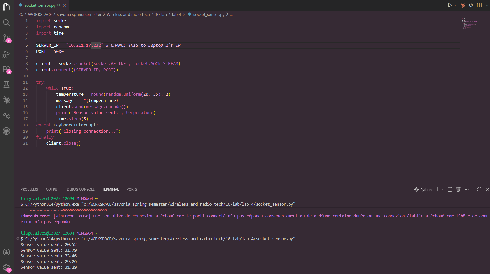
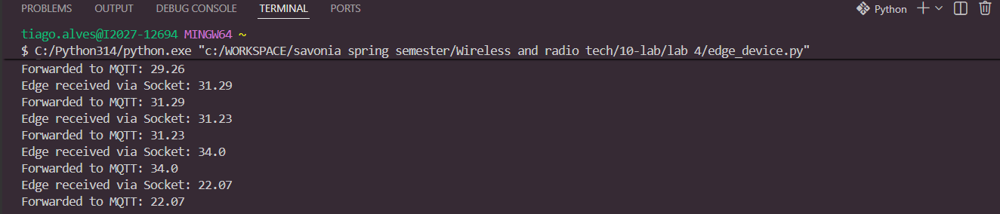
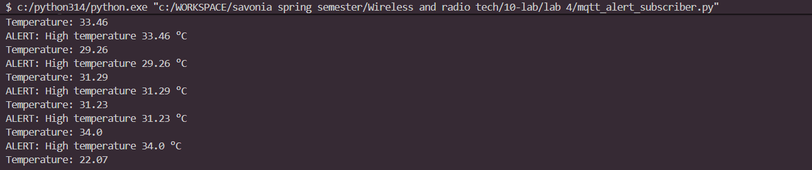

# IoT Temperature Alert System

A real-time IoT pipeline that reads temperature data from a simulated sensor, routes it through an edge device via TCP socket, publishes it to an MQTT broker, and triggers Telegram alerts when the temperature exceeds a set threshold.

---

## System Architecture

```
┌─────────────────────────────────────────────────────────────────┐
│                         LAPTOP 1                                │
│                                                                 │
│   ┌──────────────────────┐      ┌───────────────────────────┐  │
│   │   socket_sensor.py   │      │  mqtt_alert_subscriber.py │  │
│   │                      │      │                           │  │
│   │  Simulates a temp    │      │  Subscribes to MQTT topic │  │
│   │  sensor. Generates   │      │  Checks threshold (28°C)  │  │
│   │  random readings and │      │  Sends Telegram alert if  │  │
│   │  sends via TCP socket│      │  temperature is too high  │  │
│   └──────────┬───────────┘      └──────────────┬────────────┘  │
│              │ TCP Socket                       │ MQTT Subscribe│
└──────────────┼──────────────────────────────────┼───────────────┘
               │                                  │
               ▼                                  │
┌─────────────────────────────┐                   │
│         LAPTOP 2            │                   │
│                             │                   │
│   ┌─────────────────────┐   │                   │
│   │   edge_device.py    │   │                   │
│   │                     │   │                   │
│   │  TCP server that    │   │                   │
│   │  receives sensor    │   │                   │
│   │  data and publishes │   │                   │
│   │  to MQTT broker     │   │                   │
│   └──────────┬──────────┘   │                   │
│              │ MQTT Publish  │                   │
└──────────────┼───────────────┘                   │
               │                                  │
               ▼                                  │
┌─────────────────────────────────────────────────┴───────────────┐
│                    MQTT Broker                                  │
│                   broker.emqx.io                                │
│              Topic: savonia/iot/temperature                     │
└─────────────────────────────────────────────────────────────────┘
               │
               ▼
┌──────────────────────────────┐
│       Telegram Bot API       │
│  Sends message to your chat  │
│  when temperature > 28°C     │
└──────────────────────────────┘
```

---

## MQTT Topic

| Setting | Value |
|---|---|
| Broker | `broker.emqx.io` |
| Port | `1883` |
| Topic | `savonia/iot/temperature` |
| QoS | `0` (default) |

---

## How the System Works

### 1. Temperature Sensor (`socket_sensor.py` — Laptop 1)
Simulates a hardware temperature sensor. It generates random floating-point temperature readings between 25°C and 35°C every 3 seconds and sends them as plain text strings over a TCP socket connection to the edge device (Laptop 2).

### 2. Edge Device (`edge_device.py` — Laptop 2)
Acts as a local gateway — a pattern common in real IoT deployments where raw sensor data is pre-processed before reaching the cloud. It opens a TCP server socket, accepts connections from the sensor, parses the incoming temperature strings, and immediately publishes each reading to the MQTT broker under the topic `savonia/iot/temperature`.

### 3. MQTT Broker (`broker.emqx.io` — Cloud)
A public MQTT broker that acts as the message bus between the edge device and the cloud subscriber. It receives published messages and routes them to any active subscribers on the same topic.

### 4. Alert Subscriber (`mqtt_alert_subscriber.py` — Laptop 1)
Subscribes to the MQTT topic and processes every incoming temperature message. If the value exceeds the configured threshold (28°C), it constructs an alert message and posts it to the Telegram Bot API, which delivers it to the configured chat.

### 5. Telegram Alert
Provides real-time human-readable notifications. When triggered, the bot sends a message like:
```
ALERT: High temperature 29.3 °C
```

---

## Project Structure

```
├── socket_sensor.py          # Laptop 1 — Simulated temperature sensor
├── edge_device.py            # Laptop 2 — TCP-to-MQTT edge gateway
├── mqtt_alert_subscriber.py  # Laptop 1 — MQTT subscriber with Telegram alerts
└── README.md                 # This file
```

---

## Setup & Configuration

### Prerequisites

Install required Python libraries on both laptops:

```bash
pip install paho-mqtt requests
```

### Configure the Sensor (Laptop 1)

In `socket_sensor.py`, update the edge device IP address:

```python
EDGE_HOST = "192.168.x.x"  # Replace with Laptop 2's actual IP address
```

### Configure the Alert Subscriber (Laptop 1)

In `mqtt_alert_subscriber.py`, add your Telegram credentials:

```python
TOKEN = "123456789:ABCDEFxxxxxxx"   # From BotFather
CHAT_ID = "12345678"                # From getUpdates API
```

Optionally, adjust the temperature threshold:

```python
THRESHOLD = 28  # Degrees Celsius
```

---

## Running the System

Start each script in this order:

**Step 1 — Laptop 1: Start the alert subscriber**
```bash
python mqtt_alert_subscriber.py
```

**Step 2 — Laptop 2: Start the edge device**
```bash
python edge_device.py
```

**Step 3 — Laptop 1: Start the sensor**
```bash
python socket_sensor.py
```

---

## Expected Output

**Terminal (mqtt_alert_subscriber.py):**
```
=== MQTT Alert Subscriber ===
Connecting to broker.emqx.io...
Connected to MQTT broker: broker.emqx.io
Subscribed to topic: savonia/iot/temperature
Temperature: 26.4 °C
Temperature: 27.9 °C
Temperature: 29.3 °C
ALERT: High temperature 29.3 °C
Telegram alert sent successfully.
```

**Telegram message received:**
```
ALERT: High temperature 29.3 °C
```

---

## Telegram Bot Setup

1. Open Telegram and search for **BotFather**
2. Send `/newbot` and follow the prompts to create your bot
3. Copy the **Bot Token** provided by BotFather
4. Send any message to your new bot
5. Open in your browser:
   ```
   https://api.telegram.org/botYOUR_TOKEN/getUpdates
   ```
6. Find your **Chat ID** in the response:
   ```json
   "chat": { "id": 12345678 }
   ```
7. Paste both values into `mqtt_alert_subscriber.py`

---

## Screenshot

> **Note:** Replace the placeholder below with an actual screenshot of the Telegram alert received during testing.

```



10-lab/lab 4/shared image (1).jpg

[Insert screenshot of Telegram alert message here]
```

