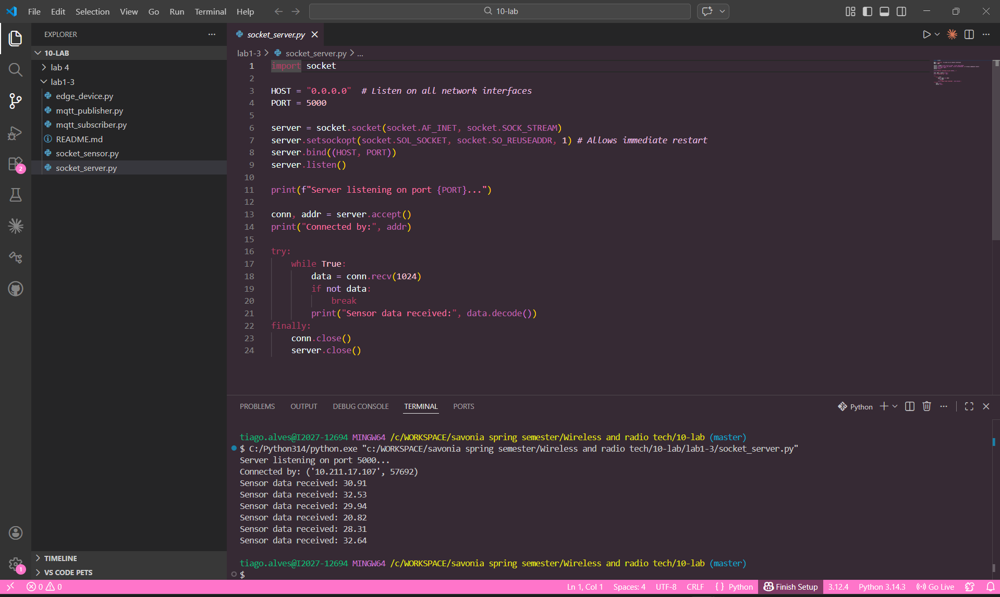
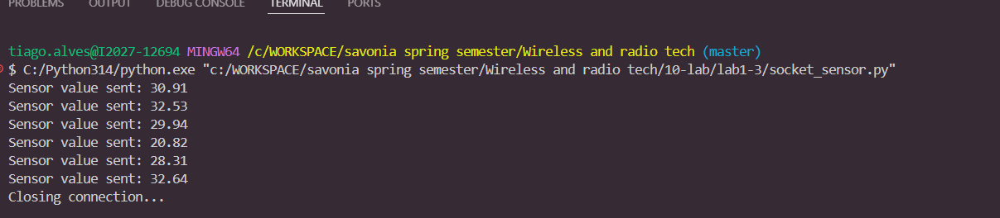
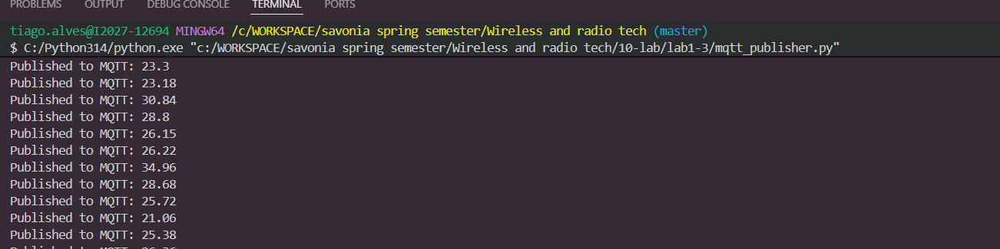
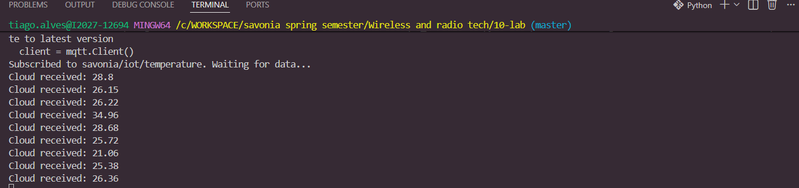
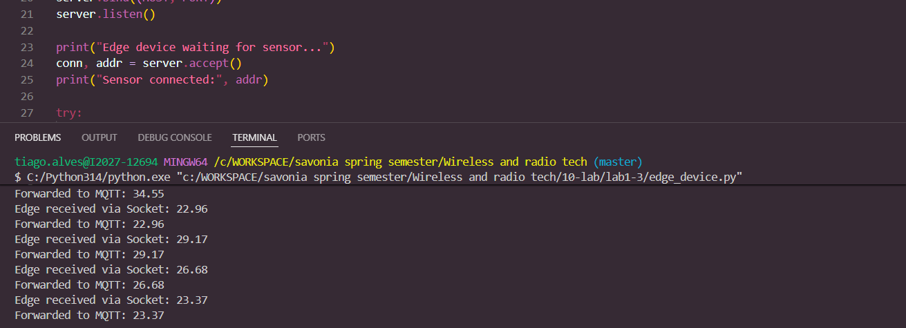

# IoT Lab Series: From Sockets to MQTT

This project demonstrates a 3-tier IoT architecture: a **Sensor Node**, an **Edge Device**, and a **Cloud Subscriber**.

## 🏗 System Architecture
1. **Sensor Node (Laptop 1)**: Generates random temperature data and sends it via **TCP Sockets**.
2. **Edge Device (Laptop 2)**: Acts as a Socket Server, receives data, and republishes it via **MQTT**.
3. **Cloud Subscriber (Laptop 1)**: Subscribes to the MQTT broker and displays the final data.

## ⚙️ Configuration
- **Socket Port:** 5000
- **MQTT Broker:** `broker.emqx.io`
- **MQTT Topic:** `savonia/iot/temperature`
- **IP Addresses used:**
  - Sensor (Laptop 1): `10.211.17.107`
  - Edge (Laptop 2): `10.211.17.107`

## 🚀 How to Run
1. Start the MQTT Subscriber on Laptop 1: `python mqtt_subscriber.py`
2. Start the Edge Device on Laptop 2: `python edge_device.py`
3. Start the Sensor on Laptop 1: `python socket_sensor.py`

## 📸 Screenshots
*(Add your screenshots here for the final submission)*
- Socket communication capture
- MQTT messages received capture

