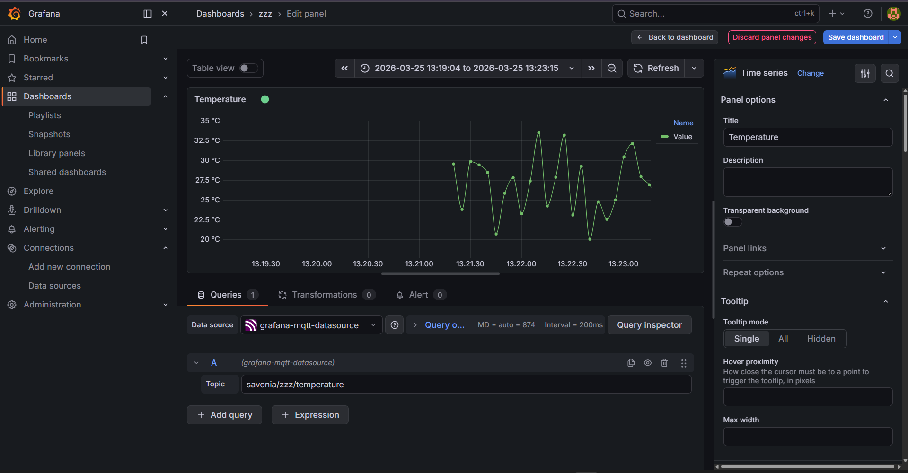

# IoT Pipeline with Grafana Live Dashboard

## System Description

This project implements a two-laptop IoT pipeline that collects simulated temperature data, forwards it over a network, publishes it via MQTT, and visualises it in real time using a Grafana dashboard.

```
Laptop 1 (Sensor)
      │
      │  TCP Socket
      ▼
Laptop 2 (Edge Device)
      │
      │  MQTT Publish
      ▼
MQTT Broker (broker.emqx.io)
      │
      │  MQTT Subscribe
      ▼
Laptop 1 (Grafana Dashboard)
```

---

## Socket Data Flow (Laptop 1 → Laptop 2)

1. `socket_sensor.py` on **Laptop 1** opens a TCP socket and connects to the IP address of Laptop 2 on port `5000`.
2. Every 2 seconds it generates a simulated temperature reading (18–35 °C) and sends the value as a UTF-8 string.
3. `edge_device.py` on **Laptop 2** listens on port `5000`, receives each message, and immediately publishes it to the MQTT broker.

---

## MQTT Configuration

| Setting | Value |
|---|---|
| Broker | `broker.emqx.io` |
| Port | `1883` |
| Topic | `savonia/iot/temperature` |
| QoS | 1 |
| Client ID (edge) | `edge_device_laptop2` |

---

## How to Run

### Prerequisites
```bash
pip install paho-mqtt
```

### 1 — Start the edge device on Laptop 2
```bash
python edge_device.py
```

### 2 — Start the sensor on Laptop 1
Edit `EDGE_DEVICE_IP` in `socket_sensor.py` to match Laptop 2's IP, then:
```bash
python socket_sensor.py
```

### 3 — Open Grafana
Navigate to `http://localhost:3000` in your browser.

---

## Grafana Setup

### Installation
1. Download the Windows installer from [https://grafana.com/grafana/download](https://grafana.com/grafana/download).
2. Run the installer and start the Grafana service (it starts automatically on Windows).
3. Open `http://localhost:3000` and log in with `admin` / `admin` (you will be prompted to change the password).

### MQTT Data Source
1. Go to **Connections → Add new data source**.
2. Search for **MQTT** and install the plugin if needed.
3. Configure:
   - **URL / Host:** `broker.emqx.io`
   - **Port:** `1883`
4. Click **Save & Test**.

### Dashboard Panel
1. Click **+ → New dashboard → Add visualization**.
2. Select the **MQTT** data source.
3. In the query editor, set the topic to:
   ```
   savonia/iot/temperature
   ```
4. Choose a suitable visualisation type (e.g. **Time series** or **Gauge**).
5. Save the dashboard.

---

## Grafana Dashboard Screenshot

> **Note:** Replace the placeholder below with an actual screenshot once the pipeline is running.


The panel displays the live temperature stream received from the MQTT topic `savonia/iot/temperature`. Values fluctuate between roughly 18 °C and 35 °C as the simulated sensor generates new readings every 2 seconds. The time-series panel shows the data as a continuous line, making it easy to spot trends or anomalies at a glance.

---

## Limitation of Live-Only MQTT Visualisation

The Grafana MQTT data source subscribes to the broker in real time but **does not persist any data**. If Grafana is closed or the browser tab is refreshed, all previously received values are lost. There is no query-able history. To enable historical graphs, a storage backend such as **InfluxDB**, **Loki**, or another time-series database must be added to the pipeline, and a separate subscriber must write incoming MQTT messages to that store.

---

## Reflection Questions

### 1. What is the role of Grafana in this system?
Grafana acts as the visualisation layer. It subscribes to the MQTT broker, receives the live temperature stream, and renders it in a human-readable panel. It translates raw numeric payloads into charts and gauges that make it easy to monitor the state of the system at a glance without reading raw log output.

### 2. Why is MQTT useful for monitoring applications?
MQTT is a lightweight publish-subscribe protocol designed for constrained networks and devices. Its broker-based model decouples producers (edge devices) from consumers (dashboards, databases), so multiple subscribers can receive the same data independently. Low overhead, QoS levels, and persistent sessions make it well-suited for IoT monitoring where reliability and efficiency matter.

### 3. What is the difference between live monitoring and historical storage?
Live monitoring shows the current state of a system in real time but retains no data once the session ends. Historical storage persists every data point with a timestamp so trends, anomalies, and past events can be analysed later. A complete IoT solution typically needs both: live monitoring for immediate awareness and a time-series database for retrospective analysis and reporting.

---

## Learning Outcomes

After completing this lab you should be able to:
- Forward sensor data from socket communication into MQTT.
- Connect Grafana to a live MQTT stream.
- Create a simple real-time monitoring dashboard.
- Explain the role of monitoring tools in IoT systems and understand the difference between live visualisation and persistent storage.

