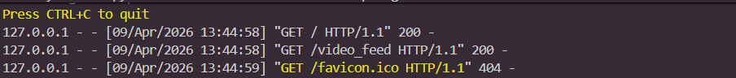

# IoT Live Stream Lab

## Team

| Role            | Machine       |
|-----------------|---------------|
| Sender / Camera | Laptop A      |
| Viewer          | Laptop A (même machine, test en local) |

**Sender IP address:** `127.0.0.1` (localhost — test en local)

---

## Project Structure

```
iot_stream_lab/
└── app.py
```

---

## How to Run

### 1. Start the stream

```bash
python app.py
```

Flask démarre et affiche :

```
* Running on http://0.0.0.0:5000
```

### 2. Open the stream in a browser

Ouvrir un navigateur sur la même machine et aller sur :

```
http://127.0.0.1:5000
```

La vidéo en direct s'affiche immédiatement.

---

## How It Works

```
Webcam → OpenCV capture → JPEG encode → Flask stream → Browser
```

1. `cv2.VideoCapture(0)` ouvre la webcam
2. Chaque frame est encodée en JPEG avec `cv2.imencode`
3. Flask sert les frames en continu via `multipart/x-mixed-replace`
4. Le navigateur reçoit et affiche les frames comme une vidéo live

---

## Results

- ✅ Webcam ouverte et flux démarré
- ✅ Flask server actif sur le port `5000`
- ✅ Stream visible dans le navigateur en local
- ✅ Vidéo mise à jour en continu en temps réel

---

## Problems & Fixes

### Test en local (pas de second laptop)

Le lab demande deux laptops sur le même réseau WiFi. Le test a été effectué en local sur une seule machine en utilisant `127.0.0.1`.

Le comportement est identique — le navigateur se connecte au serveur Flask et reçoit le flux de la même façon qu'un second laptop le ferait via l'IP réseau. Pour un vrai déploiement en pair, il suffit de remplacer `127.0.0.1` par l'IP locale de la machine (`ipconfig` → IPv4 Address).

---

## Requirements

```bash
python --version  # Python 3.x requis
pip install opencv-python flask
```