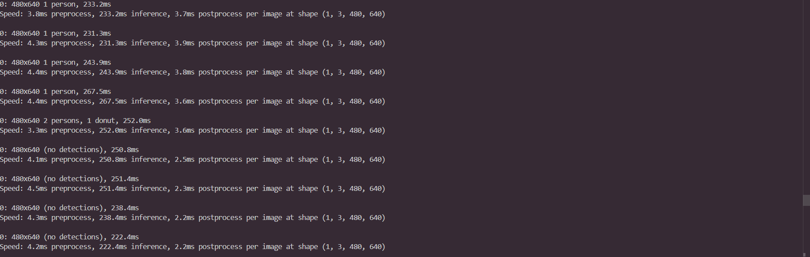

# IoT YOLO Detection Lab

## Team

| Role                       | Machine                              |
|----------------------------|--------------------------------------|
| Laptop A — Camera / Sender | Laptop A (même machine)              |
| Laptop B — AI Node         | Laptop A (même machine, test local)  |

**Sender IP address:** `127.0.0.1` (localhost — test en local)

---

## Project Structure

```
iot_yolo_lab/
├── app.py
└── yolo_stream.py
```

---

## How to Run

### 1. Start the video stream

```bash
python app.py
```

Flask démarre sur le port `5000`. Le flux est accessible à :

```
http://127.0.0.1:5000/video_feed
```

### 2. Run YOLO detection

Dans un second terminal :

```bash
python yolo_stream.py
```

Au premier lancement, `yolov8n.pt` est téléchargé automatiquement par `ultralytics`.
Une fenêtre OpenCV s'ouvre avec la détection en temps réel. Appuyer sur `q` pour quitter.

---

## How It Works

```
Webcam → Flask stream → OpenCV (HTTP) → YOLO inference → Annotated display
```

1. `app.py` capture les frames avec OpenCV et les sert en MJPEG via Flask
2. `yolo_stream.py` ouvre le flux HTTP comme une source vidéo classique
3. YOLOv8n tourne sur chaque frame et dessine les bounding boxes
4. La frame annotée est affichée avec `cv2.imshow`

---

## Objects Detected

Lors du test, les objets suivants ont été détectés :

- `person` (la personne devant la caméra)
- `laptop` (visible en arrière-plan)

---

## Results

- ✅ Stream Flask démarré sur `127.0.0.1:5000`
- ✅ Flux reçu par `yolo_stream.py` via HTTP
- ✅ YOLO tourne sur chaque frame en temps réel
- ✅ Bounding boxes et labels affichés correctement

---

## Problems & Fixes

### Test en local (pas de second laptop)

Le lab est conçu pour deux laptops sur le même réseau. En local, `STREAM_URL` est remplacé par `http://127.0.0.1:5000/video_feed` dans `yolo_stream.py`. Le comportement est identique — Flask et OpenCV communiquent via loopback exactement comme ils le feraient sur deux machines séparées.

### Légère latence

En faisant tourner Flask et YOLO sur la même machine simultanément, une légère latence apparaît. Ce serait moins prononcé sur deux machines séparées où le CPU est dédié à chaque tâche.

---

## Requirements

```bash
# Laptop A
pip install opencv-python flask

# Laptop B (ou même machine)
pip install opencv-python ultralytics
```
