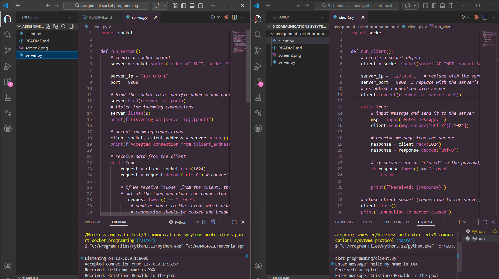
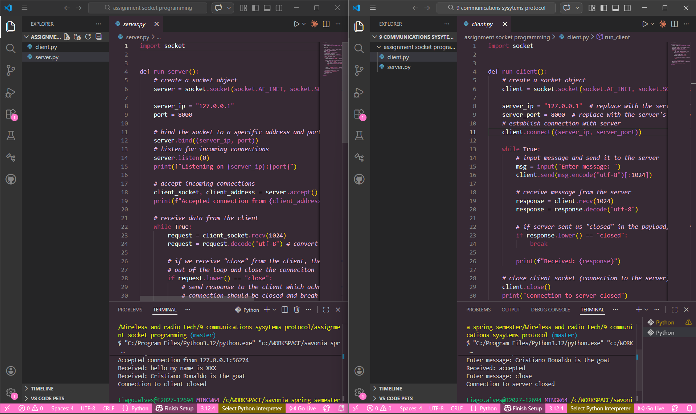
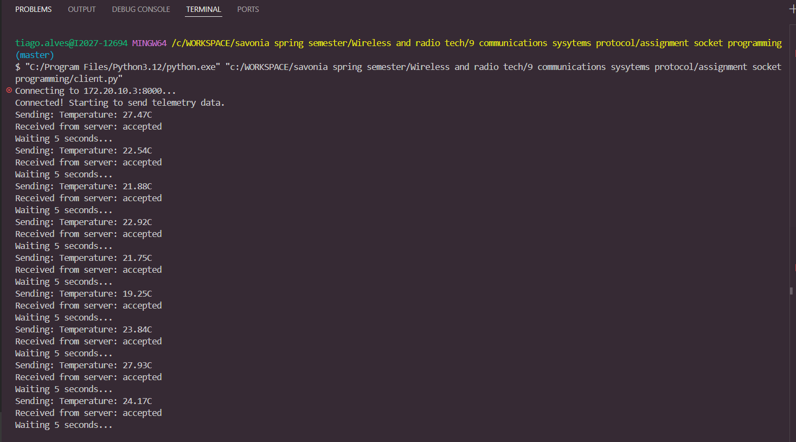

# TCP Client–Server Sensor Simulation

## Project Description

This project demonstrates basic TCP socket communication using Python.

A TCP server listens for incoming connections and receives messages from a client.
The client simulates a temperature sensor by generating random temperature values and sending them to the server every 5 seconds.

The server receives the data, prints it to the console, and sends a response back to the client.

This project was created to learn the fundamentals of TCP networking and socket programming in Python.

---

## Project Files

* **server.py** – TCP server that listens for incoming connections and receives data from the client
* **client.py** – TCP client that connects to the server and sends simulated temperature data
* **README.md** – Project documentation

---

## How to Run the Project

### 1. Start the Server

Open a terminal and run:

```
python server.py
```

Example output:

```
Listening on 127.0.0.1:8000
Accepted connection from 127.0.0.1:54231
Received: Temperature: 23.45C
Received: Temperature: 21.88C
```

---

### 2. Start the Client

Open a **second terminal window** and run:

```
python client.py
```

Example output:

```
Connecting to 127.0.0.1:8000...
Connected! Starting to send telemetry data.
Sending: Temperature: 23.45C
Received from server: accepted
Waiting 5 seconds...
```

The client will continue sending new temperature values every 5 seconds.

---

## Testing

### Test 1 – Localhost

The client and server were first tested on the same computer using:

```
127.0.0.1
```

Result:
The server successfully received temperature data from the client every 5 seconds.

---

### Test 2 – Second Device (WiFi / Hotspot)

The server was then tested using another device on the same network.

Steps:

1. Find the server computer's IP address using:

```
ipconfig
```

2. Update the server code to allow external connections:

```
server_ip = "0.0.0.0"
```

3. Update the client to connect to the server's IP address:

```
server_ip = "x.x.x.x"
```

Result:
The client successfully connected from another device and sent temperature data to the server.

---

## Example Message Format

Example of data sent by the client:

```
Temperature: 24.32C
```


## Screenshot



