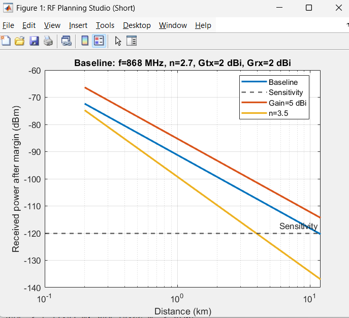
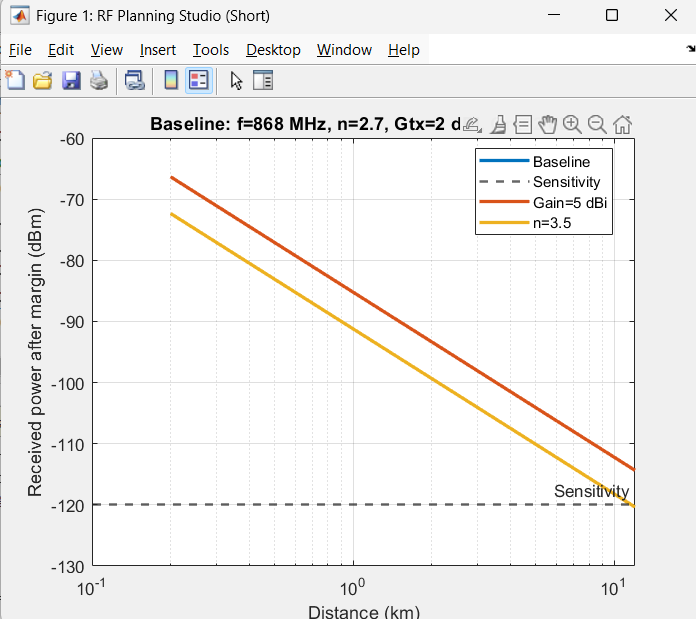
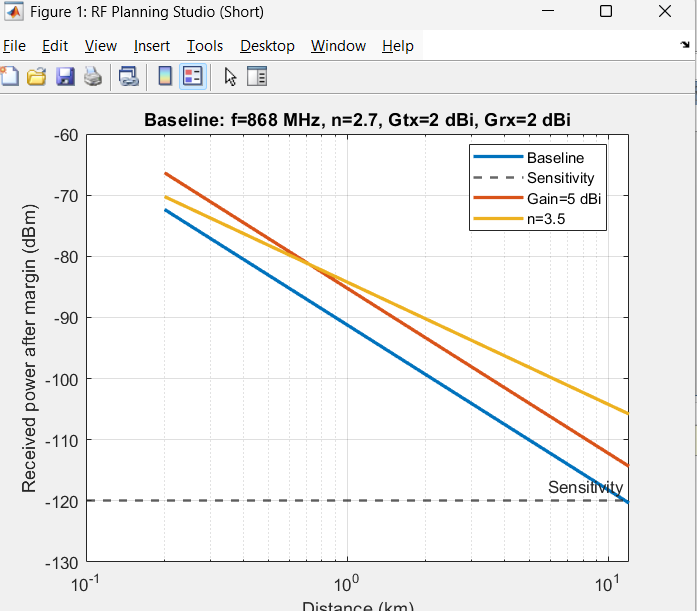
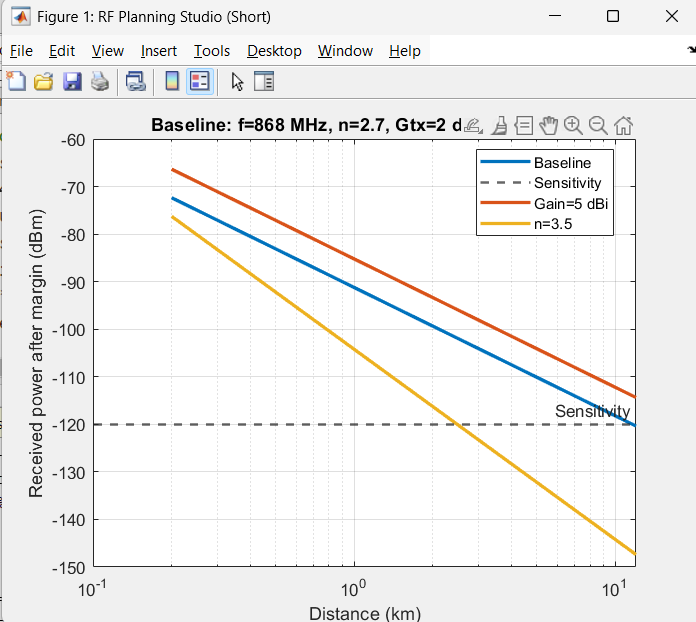

# RF Planning Studio: Link Feasibility Analysis

This project evaluates a wireless link as an RF engineer by modifying key design parameters to observe their impact on coverage distance, received power, and Fresnel clearance.

---

### 1. Increase Gateway Height (+5 m)
* The maximum Line-of-Sight (LOS) distance increases because the radio horizon is physically extended.
* Link feasibility improves geometrically, primarily by allowing the signal to "see" further over the horizon.
* Height helps overcome the Earth's curvature and clear local obstacles. However, in standard log-distance path loss models, height alone does not increase received power; it simply ensures the signal isn't physically blocked before reaching the receiver.

### 2. Increase Antenna Gain to 5 dBi
* The received power curve shifts upward across all distances. Moving from 2 dBi to 5 dBi on both the transmitter and receiver adds 6 dB to the total link budget.
* This gain allows for a significantly larger coverage radius (roughly 1.6x to 2x further depending on the environment).
* Antenna gain increases the Directivity of the signal. By focusing electromagnetic energy into a narrower beam rather than radiating it in all directions, more energy is captured by the receiving antenna at the same distance.

### 3. Change Environment Exponent (n)
* Increasing $n$ (e.g., from 2.7 to 4.0) causes a rapid, steep decay in signal strength, drastically shortening the coverage distance.
* The environment exponent has a much more aggressive impact on range than hardware gains.
* Physically, $n$ represents the "clutter" of the environment (buildings, trees, and weather). While antenna gain adds a constant boost, $n$ defines the exponential rate at which the signal disappears into the noise floor as distance increases.

### 4. Move Gateway Location (Fresnel Study)
* The Fresnel radius reaches its maximum at the midpoint (0.5D) of the link.
* Obstacles at the midpoint are the most critical because they require the most vertical clearance to avoid signal degradation.
* The Fresnel zone is an ellipsoid (football shape). If the 60% clearance rule is violated, the signal suffers from diffraction loss. This occurs when an obstacle interferes with the phase of the wavefront, causing out-of-phase reflections to cancel out the primary signal.

---

### Final Conclusion
In practical wireless deployment, the Environment Exponent ($n$) has the strongest impact on coverage. While an engineer can improve hardware—such as increasing transmit power or antenna gain—these provide only logarithmic (linear in dB) improvements. In contrast, the environment dictates the rate of signal decay exponentially. Moving from a rural setting to a dense urban environment can reduce effective range by several kilometers, a loss so severe that hardware upgrades can rarely compensate for it. Therefore, site selection and path clearance are the most critical factors in RF planning.

